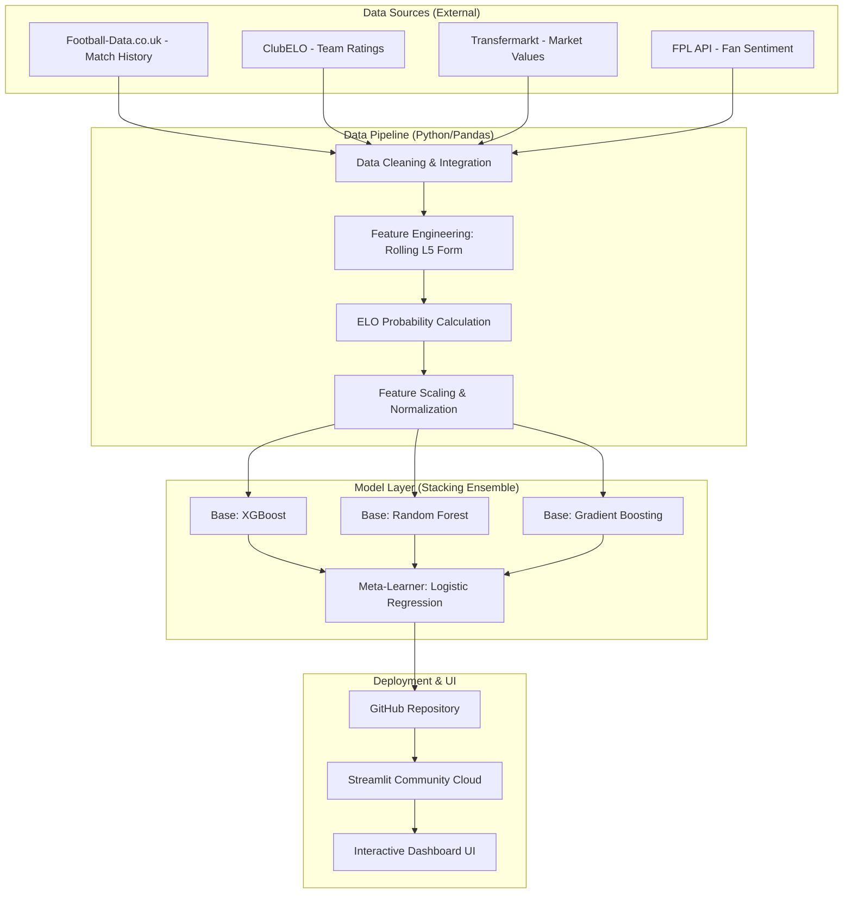
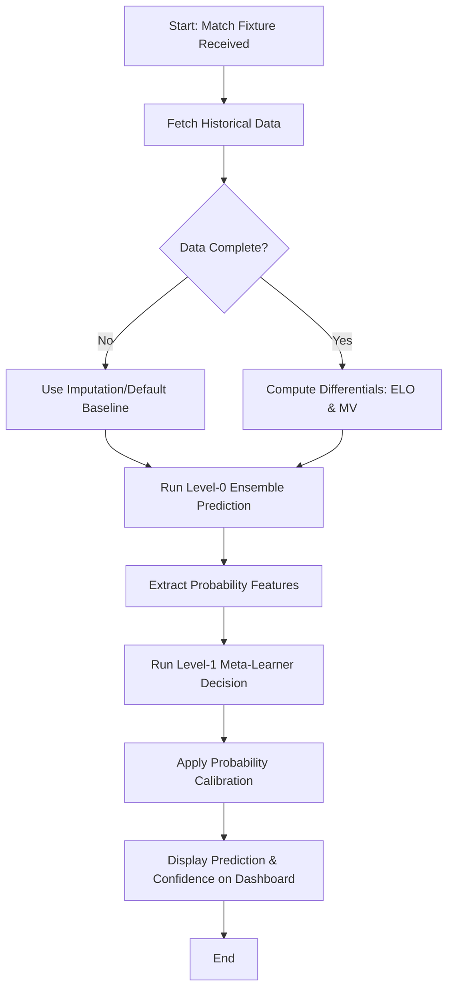

## 1. System Architecture
This infographic shows the end-to-end data flow with a modern, colorful design.

---

## 2. Logic Flowchart (Prediction Flow)
This diagram shows the step-by-step logic for a single match prediction.

